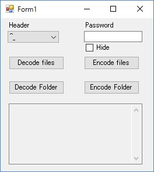

# DecodeCarotDAV
Decode CarotDAV encrypted files on local

## Overview
Encrypt/decrypt application compatible with [CarotDAV](http://www.rei.to/carotdav.html "CarotDAV") encrytion method

## Description
Decrypt [CarotDAV](http://www.rei.to/carotdav.html "CarotDAV") encryted files on local. 
You can decode encrypted files downloaded without CarotDAV.

## Requirement
This application is compiled with c# .NET 4.5.2.
Your system doesn't have the Microsoft .NET Framework 4.5.2, please install following link.
<https://www.microsoft.com/ja-JP/download/details.aspx?id=42643>

